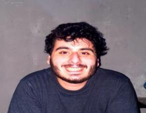

##  
## Contact Info
* Email: elalitareq@gmail.com 
* Phone: +96181587135
* Linkedin: https://www.linkedin.com/in/tareq-el-ali-963724145
## Tech Support

#### I aspire to occupy a reasonable and challenging position in the software field, as a web developer and programmer. 
#### I am currently looking to join a progressive firm, which will allow me to utilize my unique skills in the field of technology and web development.
## Education
* BS in Chemistry from LU (Faculty of Science)
* Studied Python on MIT free course website
* Studied Access DB self-tought
* Took the course "HTML-CSS-JS basics" on FreeCodeCamp.org
## Experience
### IT technition for 8+ years Private work and freelancing at different computer stores and several gaming lounges. (aug-2014 to present)
1. Fixing computer hardware problems
1. Installing Windows, linux and MacOS.
1. Fixing game problems
1. Bug testing and Googling.
###  Worked for Haffar-electronics. (2015-2018)
1. Fixing computer hardware problems.
1. Installing Windows, linux and MacOS.
1. Fixing game problems.
1. Bug testing and Googling.
1. Fixing electric circuits.
### Manager and It support at GoPro gaming lounge. (July-2018 till Feb-2020)
1. Server management.
1. Network management.
1. Cashier.
1. Solving game problems.
1. Creating and managing cache server using lancache over CDNs and other http caching servers.
### Owner of Gtech gaming lounge and manager. (Jan-2020 till Jan-2021)
* Same as the above.
### Cryptocurrency mining. (July-2020 till March-2021)
* Installing mining tools.
* Using CLI for remote management.
* Fixing GPU overheating problem and OC problems.
### Owner of Gtech IT support company. (March-2021 to present)
1. Fixing computer hardware problems.
1. Installing Windows, linux and MacOS.
1. Fixing game problems.
1. Bug testing and Googling.
1. Creating server cache with management tools
1. Fixing network problems.
1. Buying and selling Computers and their accessories.
## Languages
* Arabic (Mother tognue)
* English (Proficient)
* French (Fine)
## Skills
* Fast learner
* Dedicated
* Efficiency
* Productive
* Detail oriented
* Fast productive googling
### Reference
* Haffar-electronics
    * Hamdi: 70304291
    * Ahmad: 70635060
* GoPro
    * Monzer Bortol: 71343893
* Sting Gaming lounge (freelancing)
    * Ahmad Hawli: 70258358
* Gtech
    * Tareq El-Ali: 81587135